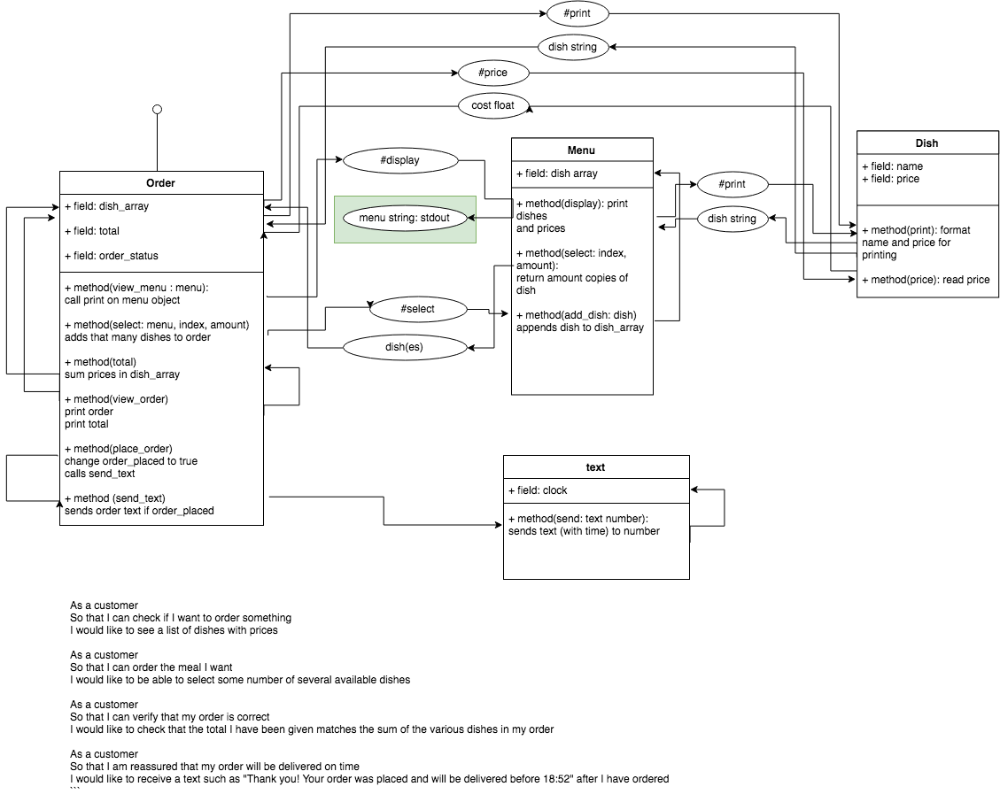

# Takeaway Challenge (Makers Weekend Challenge #2)

A basic simulation of a takeaway ordering program, done for the Makers Academy course, weekend challenge #2

## Contents

| /lib (main files) | /spec (tests) |
|---|---|
| order.rb | order_spec.rb  |
| menu.rb  | menu_spec.rb  |
| dish.rb  | dish_spec.rb  |
| dish_printer.rb | dish_printer_spec.rb |  
| texter.rb  | texter_spec.rb |

## Getting Started

**1)** Clone or download and unzip repository.  

**2)** Run bundle install to install dependencies listed in Gemfile.

**3)** The program requires a [Twilio](https://www.twilio.com/) account, with a twilio number, secure ID and authorisation token stored as environmental variables with the following names:
```
TWILIO_ACCOUNT_SSID: 'your SID here'
TWILIO_AUTH_TOKEN: 'your token here'
TWILIO_NUMBER: 'your number here'
```

One easy way to do this is to use the [Envyable](https://github.com/philnash/envyable) ruby gem to create a env.yml file which can set the above environmental variables when the program is run.

Additionally, the default phone number used to text order confirmations (see [Instructions for Use](#instructions_for_use) is also stored in an environmental variable:

```
MY_NUMBER: 'your default text number here'
```

**4)** From the root directory, run irb or pry. They .pryrc or .irbrc config files will load all dependencies automatically.

## Instructions for Use

The program has five objects:

**1) Order:** This is the object that the user interacts with. The .rc file automatically generates an order object called **order**, but new ones can be generated with **[yourOrderName] = Order.new**.

Order understand the following method calls:
- **order.show_menu** shows the current menu, with dishes and prices.
- **order.add_dish(dish menu number, amount of that dish)** adds an amount of that menu item to your order.
- **order.show_order** shows you what dishes you currently have in your order.
- **order.total** shows you the total cost of your order so far
- **order.pay(amount)** allows you to pay the cost of your order. Providing that you pay the right amount, this will **complete your order** (after which no further dishes can be added), and will send a text to the **default number** listed in your environmental variables (see [Getting Started](#getting_started).
- **order.change_menu** allows you to change the default menu for a new one.

**2) Menu:** This object is responsible for creating and displaying a menu of dishes. A small menu is created by default by the .rc files.

Menu understands several method calls, but only the following are directly useful to the user:
- **menu.add_dish(dish name, dish price)** this allows you to add a dish to the current menu.
- **menu.populate_dishes_from_array(array of dishes)** this allows you to add many dishes at once using an array consisting of two-oart arrays, each with a dish name and a dish price (in the order [dish_name, dish_price]).

**3) dish:** The dish object simply contains the dishes name and price. The user does not need to interact directly with the dish.

**4) dish_printer:** The dish printer formats dish information for display. The user does not need to interact directly with the dish printer.  

**5) texter:** The texter object sends confirmation texts via the Twilio api. The user does not need to interact directly with the texter.

**Changing Menu**

To make a completely new menu, use **[your menu name] = Menu.new**, then add dishes to it using either **menu.add_dish** or **menu.populate_dishes_from_array**. To order from your new menu, use **order.change_menu([your menu name])** to change the menu used by your order object, then interact with it using the order objects methods.


## Testing

All tests were designed and run using the rspec framework. If the rspec gem is installed, they can be run from terminal in the main repository folder using the **rspec** command.


## MODELLING ##

```
As a customer
So that I can check if I want to order something
I would like to see a list of dishes with prices
```
```
As a customer
So that I can order the meal I want
I would like to be able to select some number of several available dishes
```
```
As a customer
So that I can verify that my order is correct
I would like to check that the total I have been given matches the sum of the various dishes in my order
```
```
As a customer
So that I am reassured that my order will be delivered on time
I would like to receive a text such as "Thank you! Your order was placed and will be delivered before 18:52" after I have ordered
```


